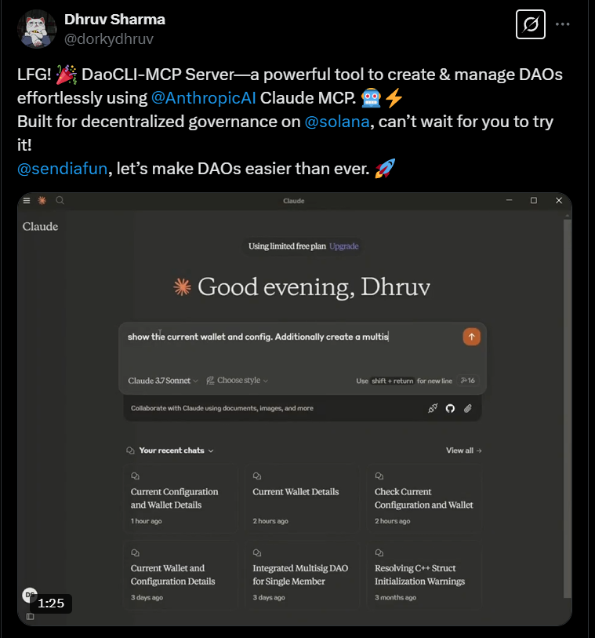

<div align="center">
  <!-- Tweet Screenshot -->
  <h3>Winner of the Solana MCP AI Agent Competition</h3>  
    <a href="https://x.com/sendaifun/status/1902788122552963460" target="_blank" rel="noopener noreferrer">
    
  </a>
</div>

# assetCLI - Goldman Sachs for AI Agents

 running your entire governance, multisig and funding lifecycle (including bonding curves, DEX integrations, etc) through an AI-assisted  agent.


## 🌟 Features

- **DAO Creation**: Create standard DAOs or integrated DAOs with Squads multisig support
- **Treasury Management**: Fund and manage both DAO treasury and multisig vaults
- **Proposal Creation**: Create SOL or token transfer proposals
- **Voting System**: Vote to approve or deny proposals
- **Execution**: Execute approved proposals
- **Wallet Management**: Import, create, and fund wallets
- **[Model Context Protocol (MCP)](https://www.claudemcp.com)**: Natural language interaction with your DAOs

## Navigation

- [CLI Interface](#cli-interface): Traditional command-line interface
- [MCP Interface](#model-context-protocol-mcp-interface): Natural language AI-assisted interface

## CLI Interface

### 📋 Prerequisites

- Node.js (v16+)
- Yarn or npm
- Solana CLI tools (for wallet management)
- A Solana wallet with SOL for transaction fees

### 🚀 Installation

Clone the repository and install dependencies:

```bash
# Clone the repository
git clone https://github.com/assetCLI/assetCLI-init.git
cd assetCLI-init

# Install dependencies
pnpm install

# Build the project
pnpm build

# Link the CLI tool globally (optional)
npm link
```

### ⚙️ Configuration

By default, the CLI connects to a local Solana validator. You can change the network:

```bash
# Set network to devnet
assetCLI config set-cluster devnet

# Set network to mainnet
assetCLI config set-cluster mainnet

# Set to local validator
assetCLI config set-cluster localhost
```

### 🔑 Wallet Setup

Before using the DAO CLI, you need to set up a wallet:

```bash
# Import an existing wallet
assetCLI wallet import ~/.config/solana/id.json

# Create a new wallet
assetCLI wallet create

# Check wallet config
assetCLI wallet show
```

### 📘 Usage Guide

#### Creating a DAO

```bash
# Create an integrated DAO with Squads multisig
assetCLI dao init --name "My DAO" --threshold 2 --members "pubkey1,pubkey2,pubkey3"

# Create a standard DAO without multisig integration
assetCLI dao init --name "Standard DAO" --threshold 2 --members "pubkey1,pubkey2,pubkey3" --integrated false
```

#### Managing Your DAOs

```bash
# List all DAOs where you are a member
assetCLI dao list

# Switch to a specific DAO
assetCLI dao use <REALM_ADDRESS>

# Show details about the current active DAO
assetCLI dao show
```

#### Funding Your DAO

```bash
# Fund with SOL (automatically detects if it's a treasury or multisig vault)
assetCLI dao fund --amount 0.5

# Fund with tokens
assetCLI dao fund-token --mint <TOKEN_MINT_ADDRESS> --amount 100
```

#### Creating Proposals

```bash
# Create a SOL transfer proposal
assetCLI proposal transfer --amount 0.1 --recipient <RECIPIENT_ADDRESS> --name "Pay Developer" --description "Payment for UI work"

# Create a token transfer proposal
assetCLI proposal transfer --mint <TOKEN_MINT_ADDRESS> --amount 50 --recipient <RECIPIENT_ADDRESS>
```

#### Voting and Execution

```bash
# List all proposals
assetCLI proposal list

# Vote to approve a proposal
assetCLI proposal vote --proposal <PROPOSAL_ADDRESS>

# Vote to deny a proposal
assetCLI proposal vote --proposal <PROPOSAL_ADDRESS> --deny

# Execute an approved proposal
assetCLI proposal execute --proposal <PROPOSAL_ADDRESS>
```

### 🧪 Testing the CLI

#### Automated Tests

The project includes automated tests for both standard and integrated DAO workflows:

```bash
# Run all tests
pnpm test

# Run specific test suites
pnpm test:integrated  # For integrated DAO tests
pnpm test:standard    # For standard DAO tests
```

#### Testing Environments

##### Local Validator

```bash
# Start a local validator
chmod +x local-dev.sh
./local-dev.sh

# Configure Solana to use localhost
solana config set localhost

# Import your wallet
assetCLI wallet import ~/.config/solana/id.json

# Airdrop SOL to your wallet
solana airdrop 10
```

##### Devnet

```bash
# Configure Solana to use devnet
solana config set devnet

# Import your wallet
assetCLI wallet import ~/.config/solana/id.json

# Airdrop SOL to your wallet
solana airdrop 2
```

#### Complete Testing Workflow

Here's a step-by-step workflow to test all major features:

1. **Initial setup**:

   ```bash
   assetCLI wallet import ~/.config/solana/dev-wallet.json
   assetCLI wallet balance
   ```

2. **Create a DAO**:

   ```bash
   assetCLI dao init --name "Test DAO" --threshold 1
   ```

3. **Fund the DAO**:

   ```bash
   assetCLI dao fund --amount 0.5
   ```

4. **Create a proposal**:

   ```bash
   assetCLI proposal transfer --amount 0.1 --recipient <ADDRESS>
   ```

5. **Vote on the proposal**:

   ```bash
   assetCLI proposal vote --proposal <PROPOSAL_ADDRESS>
   ```

6. **Verify the transfer**:
   ```bash
   solana balance -u <RECIPIENT_ADDRESS>
   ```

---

## Model Context Protocol (MCP) Interface

This tool also features a powerful [Model Context Protocol (MCP)](https://www.claudemcp.com/) interface that allows users to interact with DAOs using natural language commands through compatible AI clients like Claude Desktop.

### Setting Up the MCP Interface

#### Prerequisites

- A compatible MCP client (e.g., [Claude Desktop](https://claude.ai/desktop))
- Node.js (v16+)

### Configuration

#### Setting up Claude Desktop MCP server

1. Change the Claude Desktop MCP server settings:

For MacOS:

```bash
code ~/Library/Application\ Support/Claude/claude_desktop_config.json
```

For Windows:

```bash
code $env:AppData\Claude\claude_desktop_config.json
```

The final configuration should look like the following :

```json
{
  "mcpServers": {
    "assetCLI": {
      "command": "node",
      "args": ["$(pwd)/dist/mcp-server.js"]
    }
  }
}
```

### Using Natural Language Commands

The MCP interface supports natural language commands. Here are examples of what you can ask:

#### Configuration and Setup

```
Set my cluster to devnet
Import my wallet from ~/.config/solana/id.json
Show me my wallet information
What's the current configuration?
```

#### Creating and Managing DAOs

```
Create a new integrated DAO called "Community Fund" with 3 members and a threshold of 2
Create a standard DAO named "Charity DAO" with these members: [pubkey1, pubkey2] and a threshold of 1
Show me all the DAOs I'm a member of
I want to use the DAO with address abc123...
Tell me about my current DAO
```

#### Funding Operations

```
Fund my DAO treasury with 0.5 SOL
Send 100 tokens to my multisig vault from the mint address xyz789...
What's the balance of my DAO treasury?
```

#### Proposal Operations

```
Create a proposal to send 0.1 SOL to address abc123... with title "Web Development Fee"
Make a token transfer proposal to send 50 USDC to our developer
Show me all active proposals for my DAO
I want to vote yes on proposal abc123...
Vote against the proposal xyz789...
Execute the approved proposal abc123...
```

#### Utility Operations

```
Get the balance of address abc123...
Look up transaction signature xyz789...
What happened in transaction abc123...?
```

### MCP Documentation Resources

Access detailed documentation through the MCP interface:

```
GET assetCLI://docs/readme
GET assetCLI://docs/dao-guide
GET assetCLI://docs/proposal-guide
GET assetCLI://docs/wallet-guide
```

### Demo

<!-- Insert Twitter post or video demo here -->
<div align="center">
  <h4>Watch the assetCLI in action with MCP-powered natural language commands</h4>
    <a href="https://x.com/dorkydhruv/status/1901066331400925538">
    
  </a>
</div>

---

## 🏗️ Project Structure

```
assetCLI-init/
├── src/
│   ├── commands/         # CLI command implementations
│   ├── mcp/              # MCP tools and resources
│   ├── services/         # Core business logic
│   ├── utils/            # Utility functions
│   ├── types/            # TypeScript type definitions
│   ├── debug/            # Debug scripts for testing
│   ├── mcp-server.ts     # MCP server implementation
│   └── index.ts          # Entry point
├── tests/                # Test files
├── dist/                 # Compiled output
└── docs/                 # Documentation
```

## 🧩 Architecture

The application integrates multiple key components:

1. **SPL Governance**: For DAO creation, proposal management, and voting
2. **Squads Multisig**: For multi-signature transaction approval
3. **[Model Context Protocol (MCP)](https://www.claudemcp.com/)**: For AI-assisted interactions and operations

For integrated DAOs, the tool creates a governance structure where proposals can control a multisig vault, enabling more complex treasury management with the security of multisig approvals.

The MCP integration provides:

- Natural language processing for intuitive interactions
- Documentation and help resources
- AI-assisted operation suggestions

## 🛠️ Development

To set up a development environment:

```bash
# Clone the repository
git clone https://github.com/assetCLI/assetCLI-init.git
cd assetCLI-init

# Install dependencies
pnpm install

# Run CLI in development mode
pnpm dev

# Build the project
pnpm build
```

## 🔍 Troubleshooting

- **Insufficient funds errors**: Ensure your wallet has enough SOL
- **Transaction errors**: Verify that you're using correct account addresses
- **"Account not found" errors**: The blockchain might be congested; try again
- **Proposal execution failures**: Make sure the proposal has been approved
- **MCP connection issues**: Verify the MCP server is running and accessible
- **Natural language parsing errors**: Try using more specific language or make your request more explicit

## 📊 Telemetry

This tool collects anonymous telemetry data to help improve future development. Here's what you should know:

### What We Collect

- **First-use event only**: We only send telemetry once, on the first time you run the CLI
- **Platform information**: Basic details about your operating system (platform, release, architecture)
- **Anonymous client ID**: A hashed identifier generated from your system information and a random salt

### What We Don't Collect

- **Personal information**: No personal data, wallet addresses, or keys
- **Command usage**: No commands or queries you run are tracked
- **DAO information**: No data about your DAOs or proposals

### How It's Stored

- A configuration file at `~/.config/dao-cli/machine_salt.json` contains a random salt
- A telemetry flag file at `~/.config/dao-cli/ga_telemetry_flag.json` tracks whether telemetry has already been sent

### Opting Out

You can disable telemetry completely by using the `--noga` flag:

```bash
# Disable telemetry permanentaly
daocli --noga <command>
```

Once you use the `--noga` flag, your preference will be saved and no telemetry will ever be sent, even on future runs.

## 🧹 Cleanup

To reset your local configuration:

```bash
rm -rf ~/.config/dao-cli
```

## 📜 License

This project is licensed under the MIT License - see the LICENSE file for details.

---
